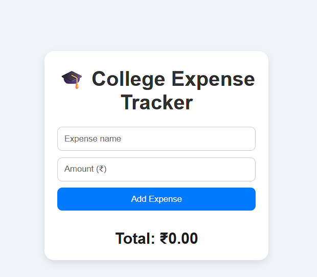
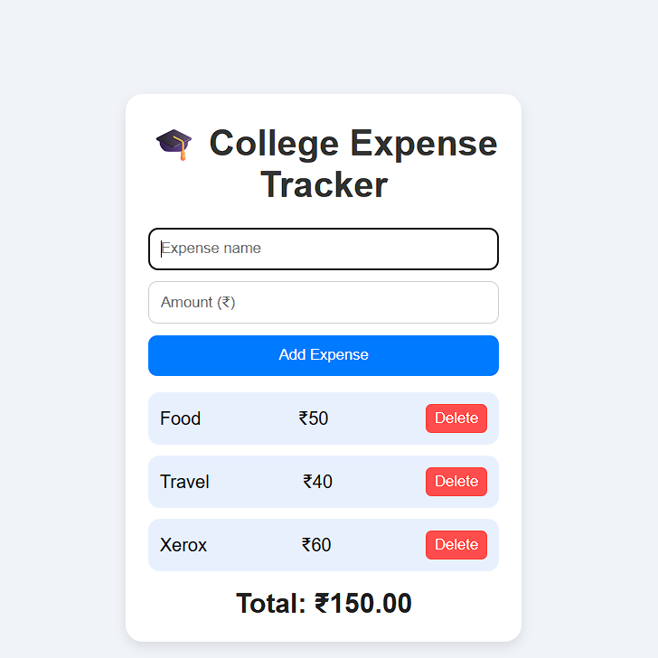
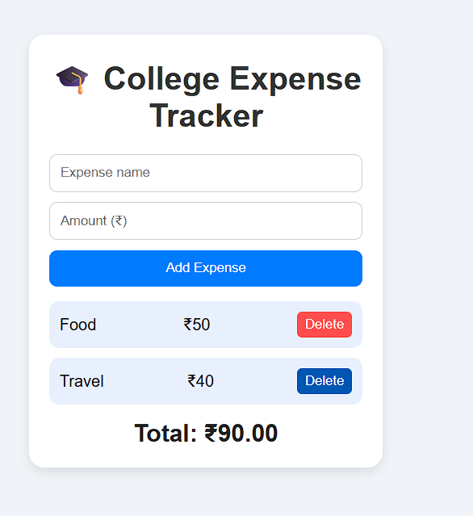

# PERSONAL-EXPENSE-TRACKER
Offline expense tracker for college students

# 🎓 College Expense Tracker

A simple and elegant **Expense Tracker Web App** built using **HTML, CSS, and JavaScript**, designed specifically for **college students** to manage their daily expenses efficiently.

---

## ✨ Features

- ➕ Add new expenses (with name and amount)  
- ❌ Delete expenses instantly  
- 💰 View total expense in real time  
- 💾 Data stored locally using `localStorage`  
- 🧱 Minimal, square-card design with clean UI  
  

---

## 🖼️ Project Preview

  

---

## 🧰 Technologies Used

| Technology | Purpose |
|-------------|----------|
| **HTML5** | Structure of the app |
| **CSS3** | Styling and layout |
| **JavaScript (ES6)** | App logic and interactivity |
| **LocalStorage** | Storing expenses persistently |

🧠 How It Works:

o Enter an expense name and amount.

o  Click “Add Expense” — the item appears in the list.

o  The total updates automatically.

o  Delete any expense using the ❌ Delete button.

o  All data stays saved even if you refresh (thanks to localStorage).

🧭 How to Use This App:
METHOD 1:
1.  Extract the zip file or open with GitHub Desktop
2. Launch index.html — you’ll see a clean expense tracker interface(for zip file)
METHOD 2(preferable):  
1. Through GitHub Desktop open this and select the option "Open in Visual Studio Code", then in visual code click on index.html file and click on go live(you have to install the live server extension in Vs Code for this to work) in the bottom right  of the screen to run this on live server.
5. Add a New Expense

##  In the input fields, enter an expense name (like “Lunch” or “Books”).

4. Enter the amount in rupees (₹).

5. Click the “Add Expense” button.

# View Your Expenses

o Each added expense appears in a list below.

o The total amount automatically updates at the bottom.

o Delete an Expense

o Click the red “Delete” button next to any expense to remove it instantly.

0 The total recalculates automatically.

# Automatic Saving

o Your expenses are stored locally using localStorage.

o Closing or refreshing the browser won’t delete your data.

## 🖼️ Screenshots

### 🏠 Home Page

### ➕ Adding an Expense

### ❌ Deleting an Expense

🧩 Future Enhancements
Here are some features to  make this project even better:

📊 Category Filters — Separate expenses by category (Food, Travel, Books, etc.)

📅 Date & Month Summary — Track spending patterns over time

📈 Visual Reports — Display expense charts using Chart.js

☁️ Cloud Sync — Store data securely using Firebase or Supabase

📱 Mobile Responsive Design — Seamless usage on phones

🤖 AI Expense Insights — Use AI to analyze your spending habits and suggest saving tips or monthly budget goals automatically

🧑‍💻 Author
Aritra Dey
📫 GitHub Profile

📜 License
This project is licensed under the MIT License — you’re free to use, modify, and share it.

